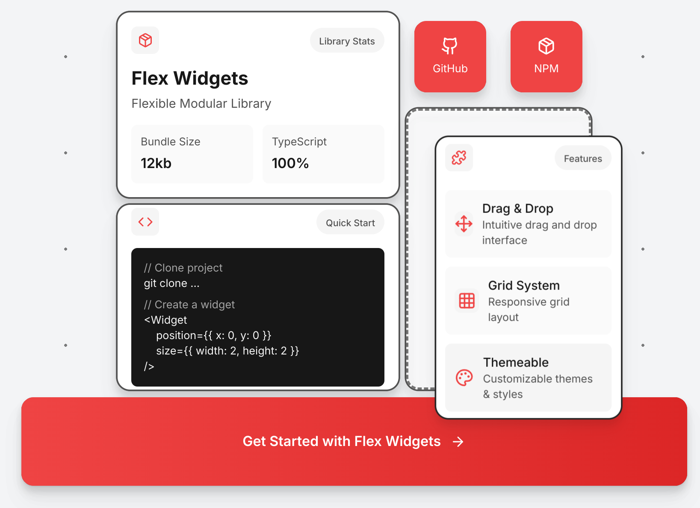

Flex Widgets is a collection of lightweight React components for building modern dashboards and data visualizations. Built with TypeScript and designed for maximum flexibility and ease of use.

## Features

- **Lightweight**
- **Flexible** - Easy to customize with Tailwind CSS
- **Responsive** - Works on any screen size

> ⚠️ **Note:** This project is currently under development.

## TODO:

- [x] Grid Widgets implementation
- [ ] Improve adaptability
- [ ] Npm package setup
